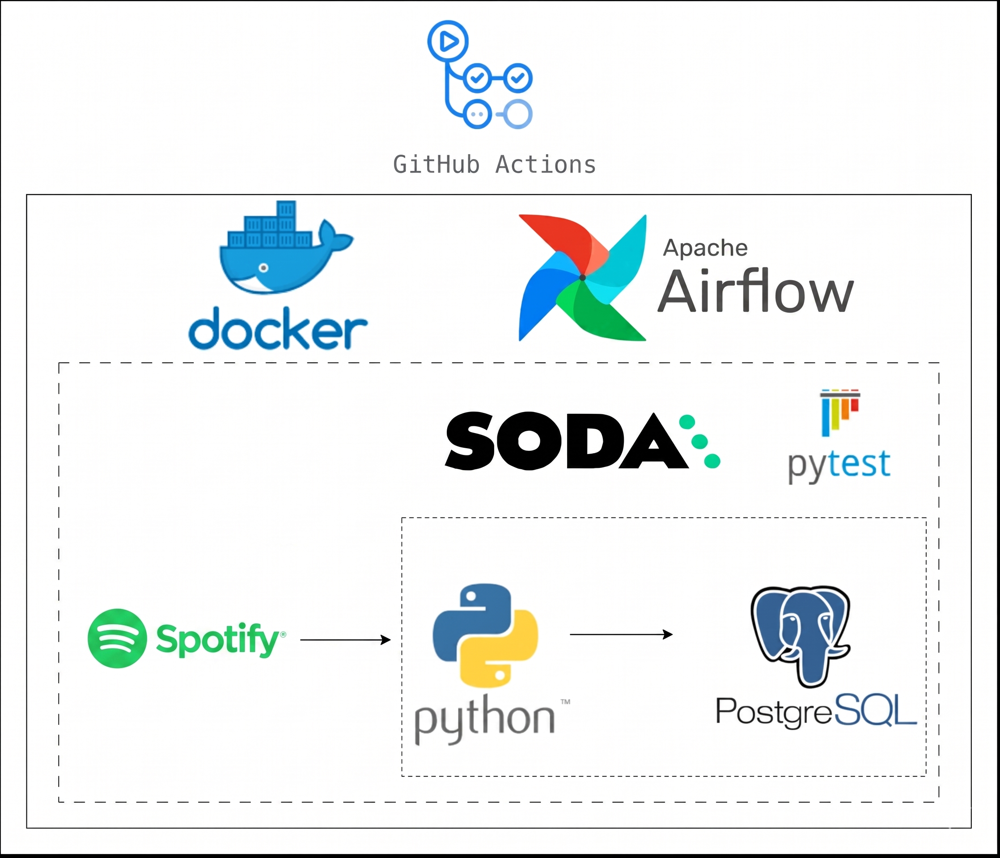

# **Spotify API - ELT**

## **Architecture**

  

## **Motivation**

The aim of this project is to get familiar with data engineering tools such as Python, Docker & Airflow to produce an ELT data pipeline. To make the pipeline more robust, best practices of unit & data quality testing and continuous integration/continuous deployment (CI-CD) are also implemented.

## **Business Context**

This project simulates a **Record Label Catalog Manager** — tracking multiple artists, their albums, and tracks. The pipeline extracts data from the Spotify API daily, normalizes it into three relational tables, and loads it into a PostgreSQL data warehouse for analysis.

## **Dataset**

As a data source, the Spotify API is used. The data is pulled for a configurable list of artists (e.g., Ed Sheeran, Adele, Sam Smith, Lewis Capaldi, Dean Lewis).

The following data is extracted across three tables:

**Artists:**
* *Artist ID*
* *Artist Name*

**Albums:**
* *Album ID*
* *Album Name*
* *Artist ID*
* *Release Date*
* *Total Tracks*
* *Album URL*

**Songs:**
* *Track ID*
* *Track Name*
* *Album ID*
* *Artist ID*
* *Duration*
* *Disc Number*
* *Track Number*
* *Explicit*

## **Summary**

This ELT project uses Airflow as an orchestration tool, packaged inside docker containers. The steps that make up the project are as follows:

1. Data is **extracted** using the Spotify API with Python scripts
2. The data is initially **loaded** into a `staging schema` which is a dockerized PostgreSQL database
3. From there, a python script is used for data **transformations** (duration conversion, date parsing, track type classification) where the data is then loaded into the `core schema`

The first (initial) API pull loads the data - this is the initial **full upload**.
Successive pulls **upsert** the values for certain variables (columns). Once the core schema is populated and both unit and data quality tests have been implemented, the data is then ready for analysis.

## **Tools & Technologies**

* *Containerization* - **Docker**, **Docker-Compose**
* *Orchestration* - **Airflow**
* *Data Storage* - **Postgres**
* *Languages* - **Python, SQL**
* *Testing* - **SODA**, **pytest**
* *CI-CD* - **Github Actions**

## **Orchestration**

Three DAGs exist, triggered one after the other. These can be accessed using the Airflow UI through http://localhost:8080. The DAGs are as follows:

* *produce_json* - DAG to extract data from Spotify API and save as JSON
* *update_db* - DAG to process JSON file and insert data into both staging and core schemas
* *data_quality* - DAG to check the data quality on both layers in the database

## **Data Storage**

The data is normalized into three tables with the following relationships:

Artists (1) --> (many) Albums (1) --> (many) Songs

To access the data, you can either access the postgres docker container and use psql, or use a database management tool like DBeaver.

## **Testing**

Both unit and data quality testing are implemented using pytest and SODA core respectively.

## **CI-CD**

CI-CD is implemented using Github Actions. It builds and pushes the Docker image, runs unit/integration tests, and performs end-to-end DAG tests.

## **License**

This project is licensed under the MIT License. See the LICENSE file for details.
